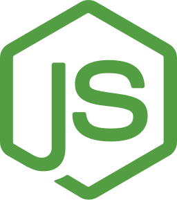
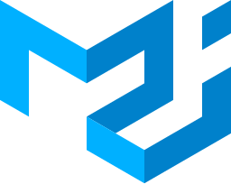

  

&nbsp;
&nbsp;

# Hi 👋 I’m Anwar Hossain  
## Full Stack Engineer (MERN Focused)

I specialize in building scalable, production-ready web applications using the **MERN stack** — MongoDB, Express.js, React.js, and Node.js — along with modern frontend technologies and backend architecture best practices.

I work across the full development lifecycle — from designing REST APIs and database schemas to building responsive UIs and deploying applications.

  

---

## 🔨 Stuff I've Broken & Rebuilt Better

  

---

## 👨‍💻 A Simple Intro About Me

I am an explorer — not just in tech, but in life.

- 🧠 I like to think deeply and solve problems.  
- 🖥️ I love to design and build full-stack systems.  
- 📚 I love to read books and expand my perspective.  
- 🏍️ I am also a moto-rider 😉  
- 🏴‍☠️ **My Motto:** 🗺️ *"Let's Build Another World"* 🗺️  

---

## 📲 Connect With Me

  
  

---

## 🛠 Languages and Tools

  
  
  
  
  
  
  
  
  
  
  
  

---

## 📊 GitHub Stats

|  |  |
| -------------------------------------------------------------------------------------------------------------------------- | --------------------------------------------------------------------------------------------------------------------------- |

---

⭐ Always building. Always learning. Always shipping.
