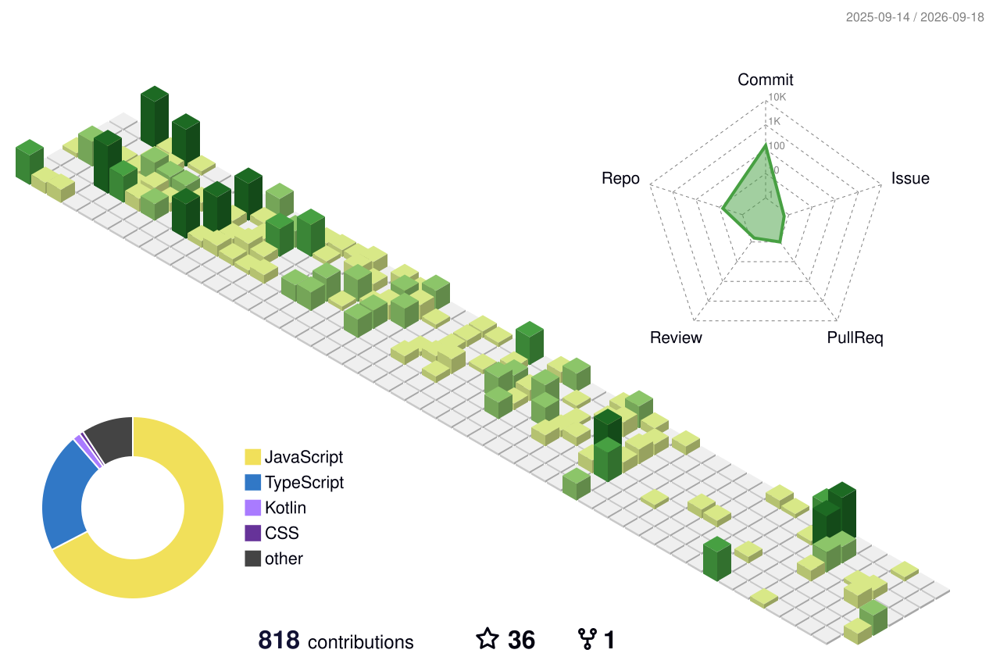

<p align="center">
  
</p>

<div align="center">

<a href="https://www.linkedin.com/in/anwarhossain1/"></a>&nbsp;
<a href="mailto:irishkhan33@gmail.com"></a>&nbsp;
<a href="https://github.com/anwarhossain1"></a>

</div>

# Hi 👋 I’m Anwar Hossain  
## Full Stack Engineer (MERN Focused)

I specialize in building scalable, production-ready web applications using the **MERN stack** — MongoDB, Express.js, React.js, and Node.js — along with modern frontend technologies and backend architecture best practices.

I work across the full development lifecycle — from designing REST APIs and database schemas to building responsive UIs and deploying applications.

<p align="center">
  
</p>

---

## 🔨 Stuff I've Broken & Rebuilt Better

<p align="center">
  
</p>

---

## 👨‍💻 A Simple Intro About Me

<p align="center">
  
</p>

---

## 🛠 Languages and Tools

<p align="center">
  
</p>

---

## 📊 The Scoreboard

<div align="center">

<picture>
  <source media="(prefers-color-scheme: dark)" srcset="https://github-readme-stats.vercel.app/api?username=anwarhossain1&show_icons=true&hide_border=true&bg_color=00000000&title_color=58a6ff&icon_color=1f6feb&text_color=c9d1d9&count_private=true&include_all_commits=true&rank_icon=github"/>
  
</picture>
<picture>
  <source media="(prefers-color-scheme: dark)" srcset="https://github-readme-streak-stats.herokuapp.com/?user=anwarhossain1&hide_border=true&background=00000000&stroke=1f6feb&ring=58a6ff&fire=58a6ff&currStreakLabel=58a6ff&sideLabels=c9d1d9&dates=8b949e&currStreakNum=c9d1d9&sideNums=c9d1d9"/>
  
</picture>

</div>

---

## 🏙️ Contribution Skyline

<!-- Generated by: https://github.com/yoshi389111/github-profile-3d-contrib -->
<div align="center">
<picture>
  <source media="(prefers-color-scheme: dark)" srcset="./profile-3d-contrib/profile-night-rainbow.svg"/>
  <source media="(prefers-color-scheme: light)" srcset="./profile-3d-contrib/profile-green-animate.svg"/>
  
</picture>
</div>

<details>
<summary>⚙️ Setup: github-profile-3d-contrib GitHub Action</summary>

Create `.github/workflows/profile-3d.yml` in your profile repo:

```yaml
name: GitHub-Profile-3D-Contrib

on:
  schedule:
    - cron: "0 18 * * *"
  workflow_dispatch:

permissions:
  contents: write

jobs:
  build:
    runs-on: ubuntu-latest
    name: generate-github-profile-3d-contrib
    steps:
      - uses: actions/checkout@v5
      - uses: yoshi389111/github-profile-3d-contrib@latest
        env:
          GITHUB_TOKEN: ${{ secrets.GITHUB_TOKEN }}
          USERNAME: anwarhossain1
      - name: Commit & Push
        run: |
          git config user.name github-actions
          git config user.email github-actions@github.com
          git add -A .
          if git commit -m "generated 3d contrib"; then
            git push
          fi
```

Then go to **Actions** → **GitHub-Profile-3D-Contrib** → **Run workflow** to generate it the first time. SVGs will appear in `./profile-3d-contrib/`.

</details>

---

⭐ Always building. Always learning. Always shipping.
